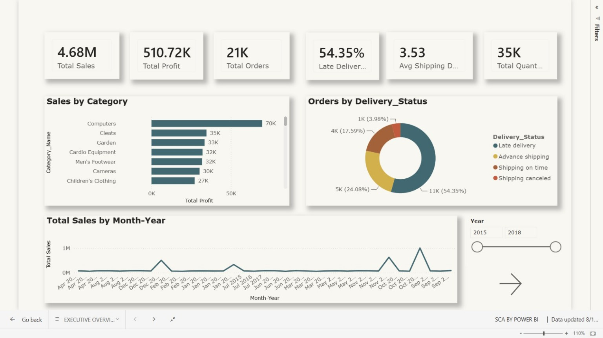
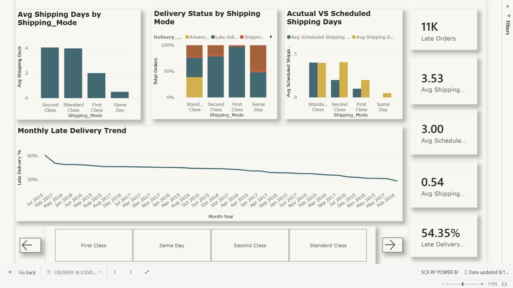
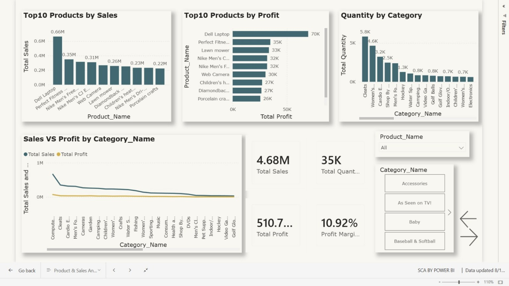
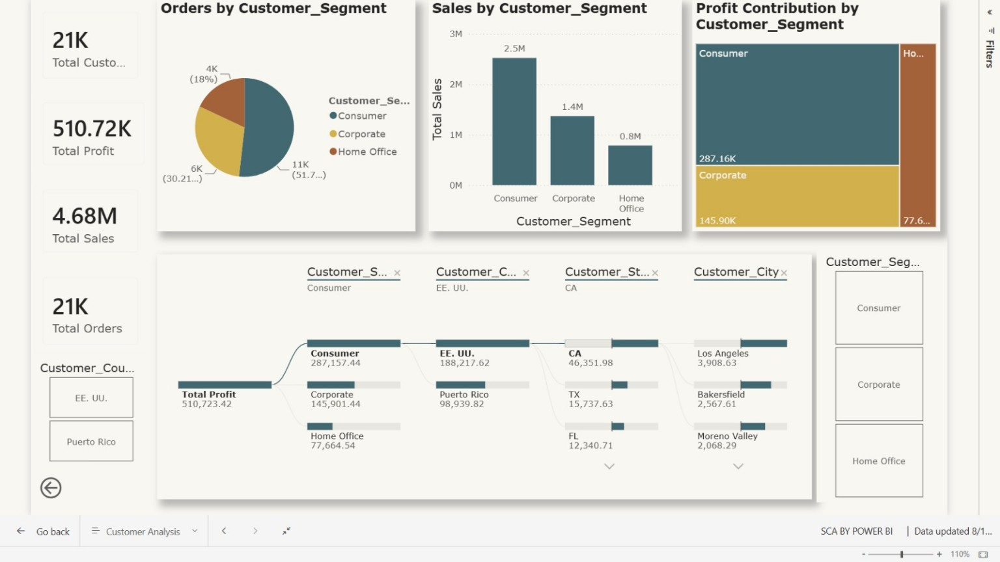

# 📊 Supply Chain Performance & Analytics Dashboard — Power BI

## 📌 Project Overview

This project presents an interactive **Supply Chain Performance & Analytics Dashboard** developed using **Microsoft Power BI**.

The objective of this project is to analyze supply chain performance across **sales, profitability, delivery operations, products, shipping modes, and customer segments** and transform transactional data into meaningful business insights.

The dashboard provides interactive visualizations, KPIs, slicers, DAX measures, and analytical tools to help understand operational and business performance.

---

## 🎯 Business Problem

Supply chain organizations generate large amounts of transactional data related to orders, products, customers, sales, shipping, and deliveries.

However, raw transactional data alone does not provide an easy way to identify:

- Poor delivery performance
- High-performing products
- Profitable product categories
- Important customer segments
- Shipping performance issues
- Sales and profit trends
- Major drivers of profitability

This project addresses these challenges by transforming the raw supply chain data into an interactive **Business Intelligence dashboard**.

---

## 🎯 Project Objectives

The main objectives of this project are:

- Analyze overall sales and profitability.
- Monitor order and delivery performance.
- Identify late-delivery patterns.
- Analyze shipping-mode performance.
- Identify top-performing products.
- Compare product sales and profitability.
- Analyze customer segments.
- Analyze customer geographic performance.
- Calculate important business KPIs.
- Provide interactive business intelligence dashboards.
- Support data-driven decision-making.

---

# 🗃️ Dataset

The project uses a transactional **Supply Chain Dataset** containing information related to:

- Orders
- Customers
- Products
- Sales
- Profit
- Quantity
- Shipping
- Delivery
- Customer locations
- Order dates

The original dataset was transformed and organized into a dimensional data model before building the dashboard.

> **Note:** The raw dataset is not included in this repository if its file size or distribution restrictions make direct upload unsuitable.

---

# 🧹 Data Preparation

The dataset was prepared using **Power Query and Power BI**.

The major data preparation steps included:

- Removing unnecessary columns.
- Selecting relevant business fields.
- Correcting data types.
- Preparing date fields.
- Organizing transactional data.
- Creating fact and dimension tables.
- Preparing relationships between tables.
- Creating a dedicated Date dimension.
- Preparing data for DAX calculations and visualization.

---

# 🏗️ Data Modeling

A **Star Schema** was created to organize the data efficiently and improve analytical performance.

### Fact Table

### `Fact_Order`

The fact table contains transactional/order-level information such as:

- Order ID
- Order Date
- Sales
- Profit
- Quantity
- Shipping information
- Delivery information

### Dimension Tables

### `Dim_Customer`

Contains customer-related information:

- Customer ID
- Customer Segment
- Customer Country
- Customer State
- Customer City

### `Dim_Product`

Contains product-related information:

- Product ID
- Product Name
- Product Category

### `Dim_Date`

Contains date-related attributes:

- Date
- Year
- Month Number
- Month
- Month-Year
- Quarter
- Day
- Day Name

### Model Structure

```text
                  Dim_Date
                     │
                     │
                     ▼
Dim_Customer ─── Fact_Order ─── Dim_Product

🧮 DAX Measures

Several DAX measures were created to calculate important business KPIs.

# Total Sales
Total Sales =
SUM(Fact_Order[Sales])

# Total Profit
Total Profit =
SUM(Fact_Order[Order_Profit_Per_Order])

#Total Quantity
Total Quantity =
SUM(Fact_Order[Order_Item_Quantity])

#Total Orders
Total Orders =
DISTINCTCOUNT(Fact_Order[Order Id])

#Total Customers
Total Customers =
DISTINCTCOUNT(Dim_Customer[Customer_Id])

#Profit Margin
Profit Margin % =
DIVIDE(
    [Total Profit],
    [Total Sales],
    0
)
# Late Delivery %
Late Delivery % =
DIVIDE(
    [Late Orders],
    [Total Orders],
    0
)
# Average Shipping Days
Avg Shipping Days =
AVERAGE(Fact_Order[Days_for_shipping (_real)])

# Average Scheduled Shipping Days
Avg Scheduled Shipping Days =
AVERAGE(Fact_Order[Days_for_shipment_(scheduled)])

Column names may vary depending on the final version of the data model.

📑 Dashboard Pages

The Power BI report contains four analytical pages.

1️⃣ Executive Overview

The Executive Overview provides a high-level view of overall supply chain performance.

Key KPIs
Total Sales
Total Profit
Total Orders
Total Quantity
Profit Margin
Delivery Performance
Analysis Includes
Sales trends
Profit trends
Category performance
Delivery status
Overall business performance

2️⃣ Delivery & Logistics

This page focuses on supply chain operational and delivery performance.

Key KPIs
Late Orders
Late Delivery %
Average Shipping Days
Average Scheduled Shipping Days
Analysis Includes
Shipping Mode Performance
Delivery Status
Actual vs Scheduled Shipping Days
Monthly Late Delivery Trends
Shipping performance comparison

This page helps identify potential delivery and logistics issues.

3️⃣ Product & Sales Analysis

This page focuses on product and category performance.

Analysis Includes
Top 10 Products by Sales
Top 10 Products by Profit
Sales vs Profit by Category
Quantity Sold by Category
Profit Margin
Product filtering
Category filtering

The analysis helps identify products that generate high revenue and products that contribute strongly to profitability.

4️⃣ Customer Analysis

This page focuses on customer performance and profitability.

Analysis Includes
Total Customers
Total Orders
Sales by Customer Segment
Profit Contribution by Customer Segment
Customer Country
Customer State
Customer City
Profit Driver Analysis

A Decomposition Tree is used to explore the factors contributing to overall profit.

📊 Dashboard Preview
### Executive Overview


### Delivery & Logistics


### Product & Sales Analysis


### Customer Analysis


🔍 Key Business Questions Answered

The dashboard helps answer questions such as:

Sales & Profitability
What are the overall sales and profit?
How does sales performance change over time?
Which products generate the highest sales?
Which products generate the highest profit?
Which categories contribute the most profit?
What is the overall profit margin?
Delivery & Logistics
What percentage of orders are delivered late?
Which shipping modes have higher shipping times?
How does actual shipping time compare with scheduled shipping time?
How does late delivery performance change over time?
Customers
Which customer segments generate the most sales?
Which customer segments contribute the most profit?
Which locations contribute to business performance?
What factors are driving profitability?
💡 Business Insights

The dashboard is designed to identify actionable insights such as:

High levels of late deliveries may indicate opportunities to improve logistics operations.
Shipping modes can be compared to identify differences in delivery performance.
Products with high sales are not necessarily the most profitable products.
Customer segments can have different contributions to sales and profit.
Product and customer analysis can help identify areas for business growth.
Comparing actual and scheduled shipping times can highlight operational inefficiencies.

Note: Final numerical insights should be interpreted from the dashboard after applying the relevant filters and validating the measures.

💼 Business Recommendations

Based on the analysis, potential business actions include:

Improve delivery performance
Investigate the major causes of late deliveries and focus on underperforming logistics areas.
Optimize shipping operations
Compare shipping modes and identify opportunities to reduce actual shipping time.
Focus on profitable products
Prioritize products and categories that generate strong profit rather than focusing only on sales volume.
Analyze customer segments
Identify high-value customer segments and develop targeted strategies.
Monitor sales and profitability together
High revenue does not always mean high profitability, so both metrics should be monitored.
Use data-driven decision making
Use interactive Power BI reports to continuously monitor supply chain performance.
🚀 Key Power BI Features Used
Interactive KPI Cards
Slicers
Page Navigation
DAX Measures
Star Schema
Power Query
Time-Series Analysis
Top-N Analysis
Treemap
Decomposition Tree
Bar Charts
Column Charts
Line Charts
Interactive Filtering
Data Modeling
🛠️ Tools & Technologies
Tool	Purpose
Power BI	Dashboard development and visualization
Power Query	Data cleaning and transformation
DAX	Measures and KPI calculations
Data Modeling	Star-schema design and relationships
CSV	Source transactional data

📁 Repository Structure
Supply-Chain-Analysis-PowerBI/
│
├── README.md
│
├── Supply_Chain_Analysis_PowerBI.pbix
│
├── Supply_Chain_Analysis_Report.pdf

🎓 Skills Demonstrated
Power BI
DAX
Power Query
Data Modeling
Star Schema
Data Visualization
Business Intelligence
KPI Development
Data Analysis
Business Analysis
Interactive Dashboard Development

📌 Project Outcome

The project transforms raw supply chain transaction data into an interactive Business Intelligence solution that provides a consolidated view of sales, profitability, delivery operations, products, and customers.

The dashboard enables users to interactively explore business performance through KPIs, slicers, trends, product analysis, customer segmentation, and profitability analysis.

👨‍💻 Author

Tanish Kumar

B.Tech — Computer Science / Data Science

⭐ If you find this project useful, feel free to explore the Power BI report and dashboard documentation.


